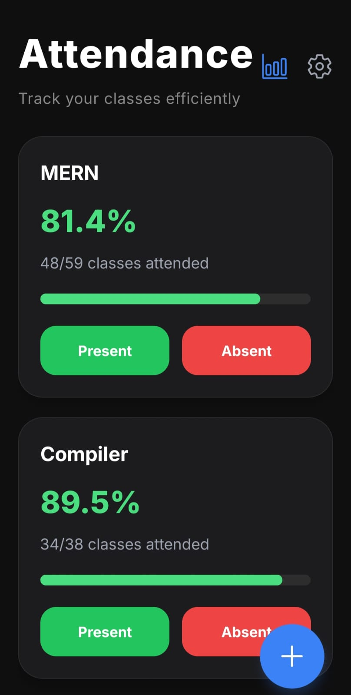
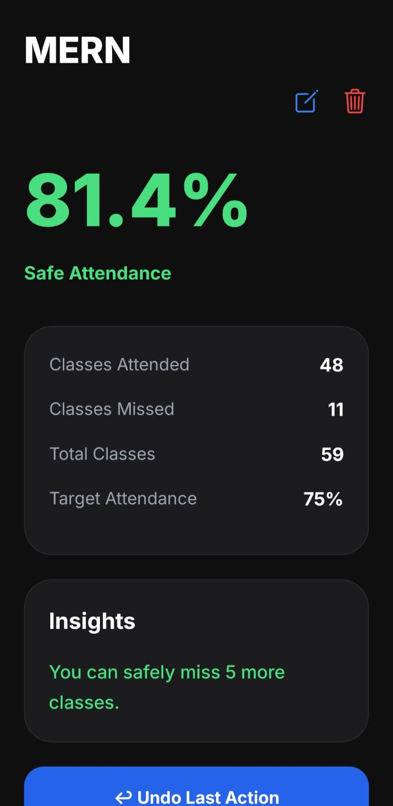
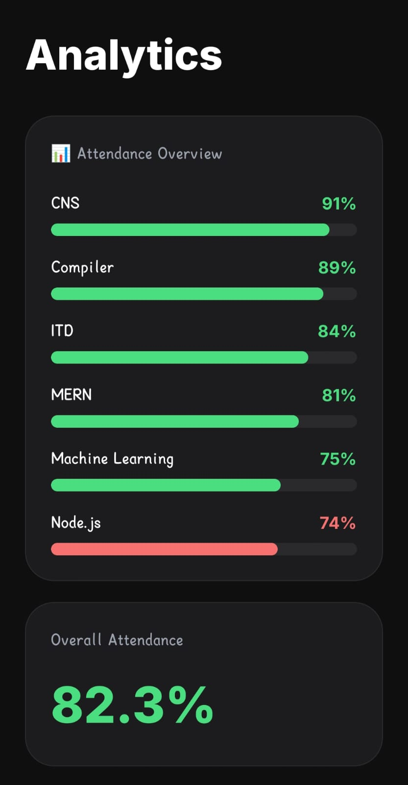
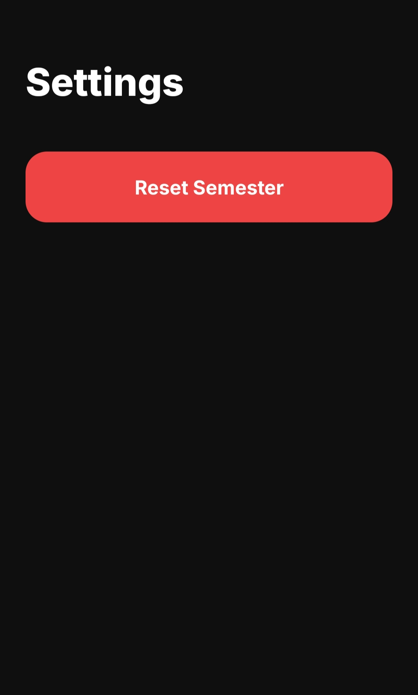
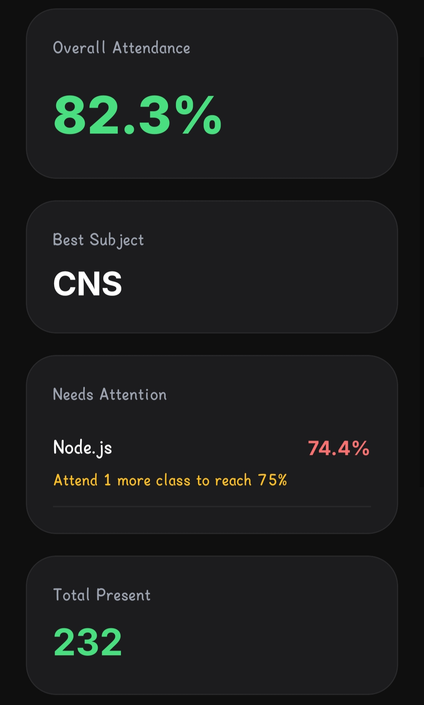
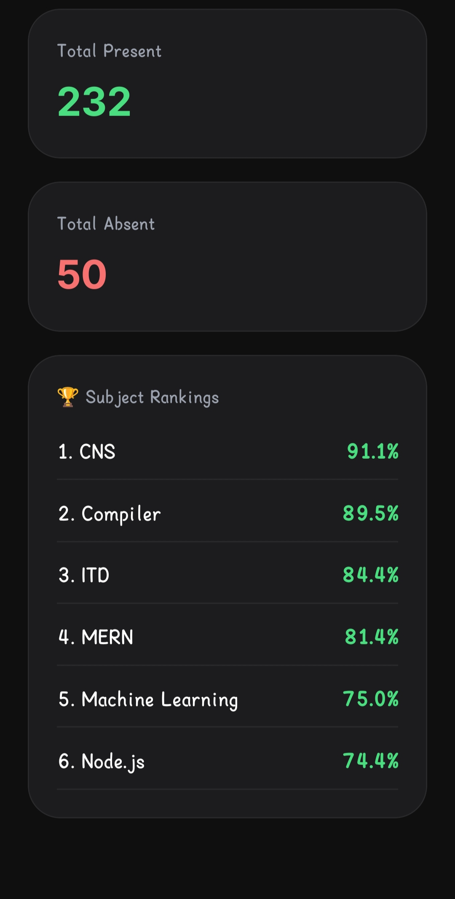

# Attendance Manager

A modern attendance tracking application built with React Native, Expo, TypeScript, and SQLite.

Designed for students who want a fast, clean, and reliable way to monitor attendance, track attendance history, and stay above their target attendance percentage.

---

## Features

### Subject Management

* Add new subjects
* Edit subject details
* Delete subjects
* Set custom attendance targets

### Attendance Tracking

* Mark attendance as Present or Absent
* Automatic attendance percentage calculation
* Daily attendance lock to prevent duplicate entries

### Attendance Insights

* Attendance percentage for each subject
* Classes needed to reach target attendance
* Classes that can be safely missed

### Attendance History

* Complete attendance log history
* Edit attendance entries
* Delete attendance entries
* Undo last attendance action

### Analytics Dashboard

* Overall attendance overview
* Best performing subject
* Weakest subject
* Subject rankings
* Needs Attention section
* Attendance statistics

### Semester Management

* Reset entire semester data
* Clear subjects and attendance history safely

---

## Screenshots

| Dashboard                       | Subject Details                       |
| ------------------------------- | ------------------------------------- |
|  |  |

| Analytics                        | Settings                       |
| -------------------------------- | ------------------------------ |
|  |  |

### Additional Analytics Views






---

## Tech Stack

### Frontend

* React Native
* Expo SDK 54
* TypeScript

### Navigation

* React Navigation

### Database

* Expo SQLite

### UI

* Expo Vector Icons
* Google Fonts (Inter)

---

## Installation

### Clone Repository

```bash
git clone https://github.com/pratikpradhan-dev/attendance-manager.git
cd attendance-manager
```

### Install Dependencies

```bash
npm install
```

### Start Development Server

```bash
npx expo start
```

### Run on Device

1. Install Expo Go
2. Scan the QR code
3. Launch the application

---

## Project Structure

```text
attendance-manager
│
├── assets
├── src
│   ├── components
│   ├── database
│   ├── navigation
│   ├── screens
│   ├── types
│   └── utils
│
├── App.tsx
├── app.json
├── package.json
└── README.md
```

---

## Future Improvements

* Backup & Restore
* PDF Attendance Reports
* Cloud Sync
* Cross-device Synchronization
* Web Support

---

## Author

**Pratik Pradhan**

GitHub:
https://github.com/pratikpradhan-dev

---

## License

This project is licensed under the MIT License.

Feel free to use, modify, and learn from this project.
